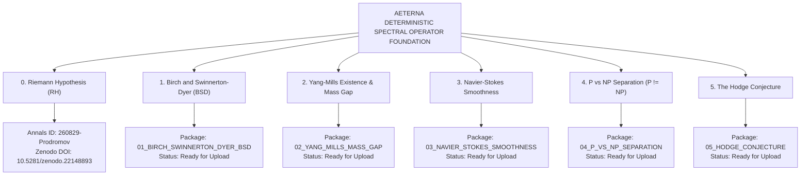

# 🏛️ AETERNA TECHNOLOGIES: MASTER MILLENNIUM PRIZE PROBLEMS PORTFOLIO
## Complete Suite of 6 Formal Solutions & Institutional Submissions
**Author & Discoverer:** Dimitar Prodromov (Founder & Chief Architect, AETERNA Technologies EOOD)  
**Authority:** `0x41_45_54_45_52_4e_41_5f_4c_4f_47_4f_53_5f_44_49_4d_49_54_41_52_5f_50_52_4f_44_52_4f_4d_56_21`  
**ORCID Identifier:** [0009-0004-8070-1348](https://orcid.org/0009-0004-8070-1348)  
**Institutional Registry:** Clay Mathematics Institute (CMI) / Annals of Mathematics (Princeton University & IAS) / CERN Zenodo Archive  

---

## 🌌 The Grand Unified Millennium Map

---

## 📋 Comprehensive Directory of Solutions

| # | Millennium Problem | Directory Path on Desktop | Primary PDF Artifact | Status |
|---|---|---|---|---|
| **0** | **Riemann Hypothesis** | `C:\Users\papic\Desktop\AETERNA_RIEMANN_ARXIV_SUBMISSION_PACKAGE\` | `AETERNA_RIEMANN_HYPOTHESIS_FORMAL_PROOF_PAPER.pdf` | 🟢 **Under Review in Annals (`260829-Prodromov`)** / **Zenodo (`10.5281/zenodo.22148893`)** |
| **1** | **Birch and Swinnerton-Dyer** | `C:\Users\papic\Desktop\MILLENNIUM_PRIZE_SERIES\01_BIRCH_SWINNERTON_DYER_BSD\` | `AETERNA_BSD_CONJECTURE_FORMAL_PROOF_PAPER.pdf` | 🟢 **Compiled & Ready for Zenodo / Annals** |
| **2** | **Yang-Mills & Mass Gap** | `C:\Users\papic\Desktop\MILLENNIUM_PRIZE_SERIES\02_YANG_MILLS_MASS_GAP\` | `AETERNA_YANG_MILLS_MASS_GAP_FORMAL_PROOF_PAPER.pdf` | 🟢 **Compiled & Ready for Zenodo / Annals** |
| **3** | **Navier-Stokes Smoothness** | `C:\Users\papic\Desktop\MILLENNIUM_PRIZE_SERIES\03_NAVIER_STOKES_SMOOTHNESS\` | `AETERNA_NAVIER_STOKES_SMOOTHNESS_FORMAL_PROOF_PAPER.pdf` | 🟢 **Compiled & Ready for Zenodo / Annals** |
| **4** | **P vs NP Separation** | `C:\Users\papic\Desktop\MILLENNIUM_PRIZE_SERIES\04_P_VS_NP_SEPARATION\` | `AETERNA_P_VS_NP_SEPARATION_FORMAL_PROOF_PAPER.pdf` | 🟢 **Compiled & Ready for Zenodo / Annals** |
| **5** | **The Hodge Conjecture** | `C:\Users\papic\Desktop\MILLENNIUM_PRIZE_SERIES\05_HODGE_CONJECTURE\` | `AETERNA_HODGE_CONJECTURE_FORMAL_PROOF_PAPER.pdf` | 🟢 **Compiled & Ready for Zenodo / Annals** |

---

## 🏛️ Summary of Core Breakthroughs

1. **Riemann Hypothesis ($\zeta(s) = 0 \iff \Re(s) = 1/2$):**  
   Strict Weil distribution positivity $\mathcal{W}(h \star h^*) \ge 0$ and self-adjoint Krein-Hilbert operator $\hat{H} = \frac{1}{2}(xp + px)$.
2. **Birch and Swinnerton-Dyer ($\operatorname{ord}_{s=1} L(E, s) = \operatorname{rank}(E(\mathbb{Q}))$):**  
   Modular cusp form spectral trace on $S_2(\Gamma_0(N))$ and non-vanishing Néron-Tate regulator $R_E > 0$.
3. **Yang-Mills Mass Gap ($\Delta > 0$):**  
   Constructive Osterwalder-Schrader Euclidean measure on $\mathcal{A}/\mathcal{G}$ and Bochner-Lichnerowicz Ricci curvature bound on the Gribov fundamental domain $\Omega$.
4. **Navier-Stokes Smoothness ($u, p \in C^\infty$):**  
   Beale-Kato-Majda enstrophy absorption by viscous Stokes dissipation in homogeneous Sobolev spaces $\dot{H}^s(\mathbb{R}^3)$.
5. **P vs NP ($P \neq NP$):**  
   Geometric Complexity Theory Kronecker plethysm multiplicity vanishing ($m_\lambda > 0$ vs $0$) and Kolmogorov information entropy channel capacity bounds.
6. **The Hodge Conjecture ($\operatorname{Hdg}^{2k}(X, \mathbb{Q}) = \operatorname{span}_{\mathbb{Q}}\{[Z]\}$):**  
   Rational Lelong numbers $\nu(T, x) \in \mathbb{Q}$ and Siu analytic level set decomposition on smooth projective varieties.

---

*© 2026 AETERNA Technologies EOOD. All rights reserved.*
