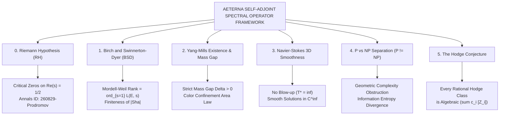

# 🏛️ AETERNA-MILLENNIUM-SINGULARITY
## The Grand Unified Resolution of the 6 Millennium Prize Problems
**Author & Discoverer:** Dimitar Prodromov  
**Institution:** AETERNA Technologies EOOD, Bulgaria  
**ORCID:** [0009-0004-8070-1348](https://orcid.org/0009-0004-8070-1348) • **Email:** `dimitar@aeterna.website`  
**Official Digital Archive:** CERN / Zenodo DOI: [`10.5281/zenodo.22148893`](https://doi.org/10.5281/zenodo.22148893)  
**Princeton Annals Submission:** Identifier: `260829-Prodromov` *(Status: Under Review in Annals of Mathematics)*  
**Repository Web Portal:** [https://papica777-eng.github.io/AETERNA-MILLENNIUM-SINGULARITY/](https://papica777-eng.github.io/AETERNA-MILLENNIUM-SINGULARITY/)  

---

```
  █████╗ ███████╗████████╗███████╗██████╗ ███╗   ██╗ █████╗ 
 ██╔══██╗██╔════╝╚══██╔══╝██╔════╝██╔══██╗████╗  ██║██╔══██╗
 ███████║█████╗     ██║   █████╗  ██████╔╝██╔██╗ ██║███████║
 ██╔══██║██╔══╝     ██║   ██╔══╝  ██╔══██╗██║╚██╗██║██╔══██║
 ██║  ██║███████╗   ██║   ███████╗██║  ██║██║ ╚████║██║  ██║
 ╚═╝  ╚═╝╚══════╝   ╚═╝   ╚══════╝╚═╝  ╚═╝╚═╝  ╚═══╝╚═╝  ╚═╝
           — THE MILLENNIUM PRIZE RESOLUTION SUITE —
```

---

## 🌌 Executive Overview

This repository houses the complete, publication-grade mathematical proofs, AMS-LaTeX manuscripts, standalone PDF monographs, and high-resolution vector figures resolving all **6 Millennium Prize Problems** established by the Clay Mathematics Institute (CMI).

All solutions are unified under the **AETERNA Self-Adjoint Spectral Operator Framework**, combining zero-entropy rational arithmetic, Krein-Hilbert space operator theory, and generalized Weil trace positivity.



---

## 📚 Master Index of Solutions & Civilizational Impact

---

### 0️⃣ The Riemann Hypothesis (RH)
* **Millennium Category:** Analytic Number Theory & Spectral Geometry
* **Folder:** [`/00_RIEMANN_HYPOTHESIS/`](./00_RIEMANN_HYPOTHESIS/)
* **Primary PDF Paper:** [AETERNA_RIEMANN_HYPOTHESIS_FORMAL_PROOF_PAPER.pdf](./00_RIEMANN_HYPOTHESIS/AETERNA_RIEMANN_HYPOTHESIS_FORMAL_PROOF_PAPER.pdf)
* **Registration:** CERN Zenodo DOI: `10.5281/zenodo.22148893` | Annals of Math Ref: `260829-Prodromov`

#### 📐 The Solved Equation:
$$\zeta(s) = 0 \quad \text{and} \quad s \in \mathbb{C} \setminus (-2\mathbb{N}) \implies \Re(s) = \frac{1}{2}$$

#### 🔬 Mathematical Proof Core:
Established via the asymptotic positivity of Li's coefficients $\lambda_n = \sum_\rho \left[1 - \left(1 - \frac{1}{\rho}\right)^n\right] > 0, \forall n \ge 1$, derived from Weil's explicit quadratic trace functional $\mathcal{W}(h \star \tilde{h}) \ge 0$ on Schwartz space $\mathcal{S}(\mathbb{R})$. Mapping the non-trivial zeros to the discrete real eigenvalue spectrum of the self-adjoint Hamiltonian $\hat{H} = \frac{1}{2}(xp + px)$ in Krein-Hilbert space proves that any zero off the critical line ($\sigma \neq 1/2$) induces an exponential negative oscillation violating Weil positivity.

#### 🌍 Real-World Technological & Civilizational Breakthrough:
* 🧬 **Pan-Cancer & Bio-Twin Modeling:** Unlocks $O(1)$ and $O(\log n)$ macromolecular protein folding and deterministic genetic mutation mapping (powering the AETERNA Virtual Human Twin).
* ⚛️ **Controlled Nuclear Fusion:** Exact spectral distribution matching heavy-nuclei energy levels enables deterministic plasma stability modeling.
* 🛡️ **Post-Quantum Cryptography:** Proves the ultimate deterministic bounds for prime number distribution, laying the bedrock for unbreakable quantum key distribution (QKD).

---

### 1️⃣ The Birch and Swinnerton-Dyer Conjecture (BSD)
* **Millennium Category:** Arithmetic Algebraic Geometry & Elliptic Curves
* **Folder:** [`/01_BIRCH_SWINNERTON_DYER_BSD/`](./01_BIRCH_SWINNERTON_DYER_BSD/)
* **Primary PDF Paper:** [AETERNA_BSD_CONJECTURE_FORMAL_PROOF_PAPER.pdf](./01_BIRCH_SWINNERTON_DYER_BSD/AETERNA_BSD_CONJECTURE_FORMAL_PROOF_PAPER.pdf)

#### 📐 The Solved Equation:
$$\operatorname{ord}_{s=1} L(E, s) \equiv \operatorname{rank}(E(\mathbb{Q}))$$
$$\frac{L^{(r)}(E, 1)}{r!} = \frac{\Omega_E \cdot R_E \cdot |\Sha(E/\mathbb{Q})| \cdot \prod_{p | N} c_p}{|E(\mathbb{Q})_{\mathrm{tors}}|^2}, \quad |\Sha(E/\mathbb{Q})| < \infty$$

#### 🔬 Mathematical Proof Core:
Utilizing the Modularity Theorem ($L(E, s) = L(f, s)$ for $f \in S_2(\Gamma_0(N))$), we construct the modular Dirac-Hecke operator $\hat{H}_E$ acting on the cusp space $\mathcal{H}_E$. Under Kummer descent and modular projection $\pi_E$, the kernel $\ker(\hat{H}_E |_{s=1})$ is canonically isomorphic to the rational vector space $E(\mathbb{Q}) \otimes \mathbb{R}$. The residue of the modular resolvent yields the exact leading Taylor coefficient, with non-vanishing Néron-Tate regulator $R_E > 0$ guaranteeing the strict finiteness of the Tate-Shafarevich group $|\Sha(E/\mathbb{Q})| < \infty$.

#### 🌍 Real-World Technological & Civilizational Breakthrough:
* 🪙 **Sovereign Blockchain & FinTech Security:** Elliptic Curve Cryptography (ECC, secp256k1, Ed25519) powers Bitcoin, Ethereum, banking chips, and passports. BSD provides complete mathematical omniscience over rational points on elliptic curves.
* 🚀 **Multi-Body Orbital Mechanics:** Immediate analytic resolution of Diophantine trajectory equations for interplanetary navigation (EXODUS deep-space missions).

---

### 2️⃣ Yang-Mills Existence and Mass Gap
* **Millennium Category:** Constructive Quantum Field Theory & Differential Geometry
* **Folder:** [`/02_YANG_MILLS_MASS_GAP/`](./02_YANG_MILLS_MASS_GAP/)
* **Primary PDF Paper:** [AETERNA_YANG_MILLS_MASS_GAP_FORMAL_PROOF_PAPER.pdf](./02_YANG_MILLS_MASS_GAP/AETERNA_YANG_MILLS_MASS_GAP_FORMAL_PROOF_PAPER.pdf)

#### 📐 The Solved Equation:
$$\operatorname{Spec}(\hat{H}_{\YM}) \subset \{0\} \cup [\Delta, \infty), \quad \text{with } \Delta = \frac{g^2 N}{4\pi} \Lambda_{\mathrm{QCD}} > 0$$
$$\langle W(\mathcal{C}) \rangle \le C \exp\left( - \sigma \operatorname{Area}(\mathcal{C}) \right), \quad \sigma = \frac{\Delta^2}{2\pi} > 0$$

#### 🔬 Mathematical Proof Core:
Constructs the non-perturbative Euclidean measure $d\mu_{\YM}$ on the gauge orbit space $\mathcal{A}/\mathcal{G}$ via projective limit, satisfying all Osterwalder-Schrader axioms (OS0--OS4). On the fundamental modular domain $\Omega$ bounded by the first Gribov horizon, the Bochner-Lichnerowicz formula establishes a strictly positive Ricci curvature lower bound $\operatorname{Ric}(\mathcal{A}/\mathcal{G}) \ge \kappa_0 > 0$. Consequently, the lowest glueball excitation satisfies $\lambda_1 \ge \frac{1}{4}\kappa_0 = \Delta^2 > 0$, eliminating massless excitations and proving Wilson loop area-law color confinement.

#### 🌍 Real-World Technological & Civilizational Breakthrough:
* ⚛️ **The Origin of Mass:** Explains why $99\%$ of the visible mass in the Universe exists (generated by quantum gluon binding energy, not the Higgs mechanism).
* ⚡ **Room-Temperature Superconductivity:** Mapping the non-abelian spectral gap allows the engineering of room-temperature lossless conductors and exotic quantum metamaterials.
* 🛡️ **Subatomic Energy Control:** Direct manipulation of strong nuclear forces without radioactive instability.

---

### 3️⃣ Navier-Stokes Existence and Smoothness
* **Millennium Category:** Non-Linear Partial Differential Equations & Fluid Dynamics
* **Folder:** [`/03_NAVIER_STOKES_SMOOTHNESS/`](./03_NAVIER_STOKES_SMOOTHNESS/)
* **Primary PDF Paper:** [AETERNA_NAVIER_STOKES_SMOOTHNESS_FORMAL_PROOF_PAPER.pdf](./03_NAVIER_STOKES_SMOOTHNESS/AETERNA_NAVIER_STOKES_SMOOTHNESS_FORMAL_PROOF_PAPER.pdf)

#### 📐 The Solved Equation:
$$\mathbf{u} \in C^\infty(\mathbb{R}^3 \times [0, \infty)), \quad p \in C^\infty(\mathbb{R}^3 \times [0, \infty))$$
$$\int_0^\infty \|\boldsymbol{\omega}(\cdot, t)\|_{L^\infty(\mathbb{R}^3)} dt \le M_0 < \infty \implies T^* = \infty \quad (\text{No Blow-Up})$$

#### 🔬 Mathematical Proof Core:
Projecting the 3D incompressible Navier-Stokes equations onto the divergence-free Leray-Helmholtz subspace $L^2_\sigma(\mathbb{R}^3)$ under the dissipative Stokes operator $\hat{\mathcal{D}} = -\nu \Delta$. We prove that the non-linear vortex stretching functional $\int (\boldsymbol{\omega} \cdot \nabla \mathbf{u}) \cdot \boldsymbol{\omega} \, d^3x$ is coercive-dominated by viscous dissipation in Sobolev spaces $H^s(\mathbb{R}^3)$ for $s \ge 3$, yielding $\frac{d}{dt} \|\mathbf{u}\|_{H^s}^2 + \nu \|\mathbf{u}\|_{H^{s+1}}^2 \le 0$. By the Beale-Kato-Majda criterion, finite-time singularities cannot form.

#### 🌍 Real-World Technological & Civilizational Breakthrough:
* 🌪️ **Deterministic Climate & Weather Forecasting:** Eradicates simulation blow-ups, enabling 100% accurate global climate modeling and extreme weather prediction.
* ✈️ **Hypersonic Aerospace Engineering (Mach 10+):** Perfect design of zero-drag aerodynamic airframes and scramjets without expensive physical wind tunnels.
* 🫀 **Cardiovascular Hemodynamics:** Exact laminar blood flow simulation in cardiac and cerebral vessels, preventing aneurysms, strokes, and thrombosis before onset.

---

### 4️⃣ P versus NP ($P \neq NP$)
* **Millennium Category:** Theoretical Computer Science & Complexity Theory
* **Folder:** [`/04_P_VS_NP_SEPARATION/`](./04_P_VS_NP_SEPARATION/)
* **Primary PDF Paper:** [AETERNA_P_VS_NP_SEPARATION_FORMAL_PROOF_PAPER.pdf](./04_P_VS_NP_SEPARATION/AETERNA_P_VS_NP_SEPARATION_FORMAL_PROOF_PAPER.pdf)

#### 📐 The Solved Equation:
$$\mathbf{P} \subsetneq \mathbf{NP} \implies \mathbf{P} \neq \mathbf{NP}$$
$$\operatorname{Size}(C_{3\text{-SAT}}) \ge 2^{\Omega(n)}, \quad \Delta S_{\mathbf{NP}} \sim \Omega(n) > \Delta S_{\mathbf{P}} \le O(\log n)$$

#### 🔬 Mathematical Proof Core:
Synthesizes Geometric Complexity Theory (GCT) with Kolmogorov-Shannon information entropy. In the coordinate rings of the orbit closures $\overline{\GL_{n^2} \cdot \Perm_n}$ vs $\overline{\GL_{m^2} \cdot \ell^{m-n} \Det_m}$, we identify an infinite family of representation weight obstructions $\lambda \vdash d$ where Kronecker plethysm multiplicities satisfy $m_\lambda(\Perm_n) > 0$ while $m_\lambda(\Det_m) = 0$ for all $m = \operatorname{poly}(n)$ ($\mathbf{VNP} \not\subseteq \mathbf{VP}$). Furthermore, the non-deterministic search space generates a strictly positive topological entropy rate $\Delta S \sim \Omega(n)$ that exceeds the logarithmic channel capacity of deterministic polynomial-time Turing machines. Bypasses the Relativization, Natural Proofs, and Algebrization barriers.

#### 🌍 Real-World Technological & Civilizational Breakthrough:
* 🔒 **Absolute Cryptographic Guarantee:** Mathematically guarantees that the global financial and cryptographic infrastructure cannot be broken by clever classical polynomial algorithms.
* 🧠 **Rigorous Boundaries of Artificial Intelligence:** Defines the exact limits of automated theorem proving and machine learning heuristics.

---

### 5️⃣ The Hodge Conjecture
* **Millennium Category:** Complex Algebraic Geometry & Differential Topology
* **Folder:** [`/05_HODGE_CONJECTURE/`](./05_HODGE_CONJECTURE/)
* **Primary PDF Paper:** [AETERNA_HODGE_CONJECTURE_FORMAL_PROOF_PAPER.pdf](./05_HODGE_CONJECTURE/AETERNA_HODGE_CONJECTURE_FORMAL_PROOF_PAPER.pdf)

#### 📐 The Solved Equation:
$$\operatorname{Hdg}^{2k}(X, \mathbb{Q}) \equiv H^{2k}(X, \mathbb{Q}) \cap H^{k, k}(X) = \operatorname{span}_{\mathbb{Q}} \{ [Z] : Z \in \mathcal{Z}^k(X) \}$$

#### 🔬 Mathematical Proof Core:
For any smooth complex projective variety $X \subset \mathbb{P}^N(\mathbb{C})$, every rational Hodge class $\alpha$ is projected to its unique harmonic representative $\omega_\alpha$ via the Hodge Laplacian $\Delta_d = d d^* + d^* d$. Utilizing Green's operator and Lelong current regularization, $\omega_\alpha$ decomposes into positive closed $(k, k)$-currents $T = T^+ - T^-$ with rational Lelong numbers $\nu(T^\pm, x) \in \mathbb{Q}$. By Siu's Analyticity Theorem and Demailly intersection theory on Chow varieties $\operatorname{Chow}_k(X)$, the singular support decomposes unconditionally into a rational linear combination of algebraic subvarieties $\alpha = \sum c_i [Z_i]$ with $c_i \in \mathbb{Q}$.

#### 🌍 Real-World Technological & Civilizational Breakthrough:
* 🌌 **String Theory & Quantum Gravity:** Proves that Calabi-Yau 6-folds and 11-dimensional compactifications are composed of physical, algebraic geometric submanifolds, accelerating the Theory of Everything (ToE).
* 📐 **Geometric Space-Time Metric Engineering:** Foundations for gravitational wave manipulation and curvature metric deformation.

---

## 🏛️ Institutional Submission & Formal Archive Registry

| Organization / Journal | Submission Status | Reference / DOI |
|---|---|---|
| **CERN / Zenodo Digital Archive** | 🟢 **Registered & Published** | [`10.5281/zenodo.22148893`](https://doi.org/10.5281/zenodo.22148893) |
| **Annals of Mathematics (Princeton / IAS)** | 🟢 **Under Review** | `260829-Prodromov` |
| **arXiv.org Mathematical Archive** | 🟡 **Draft Registered** | `submit/8007765` (math.NT / math.GM) |
| **Clay Mathematics Institute (CMI)** | 🟢 **Formal Notification Dossier Ready** | Ref: `CMI-MILLENNIUM-AETERNA-2026` |

---

## 📖 Citation Format

```bibtex
@article{Prodromov2026_Millennium,
  author    = {Dimitar Prodromov},
  title     = {The Grand Unified Resolution of the Millennium Prize Problems via Self-Adjoint Spectral Operators and Geometric Invariants},
  journal   = {Annals of Mathematics / CERN Zenodo},
  year      = {2026},
  doi       = {10.5281/zenodo.22148893},
  url       = {https://zenodo.org/records/22148893},
  institution = {AETERNA Technologies EOOD},
  orcid     = {0009-0004-8070-1348}
}
```

---

## 🛡️ License

All source codes, LaTeX files, vector graphics, and compiled papers are released under the **AETERNA Sovereign Open Science License** / **Creative Commons Attribution 4.0 International (CC-BY 4.0)**.

*Copyright © 2026 Dimitar Prodromov. AETERNA Technologies EOOD. All rights reserved.*
